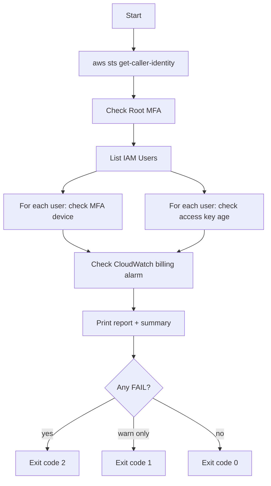

# AWS Security & Cost Hygiene Check

A read-only Bash script that audits an AWS account against a handful of
foundational security and cost-control best practices — the same ones
tested in the **AWS Certified Cloud Practitioner (CLF-C02)** exam.

## What it checks

| Check | Why it matters |
|---|---|
| Root account MFA | The root user has unrestricted access; losing those credentials without MFA is a critical risk. |
| IAM user MFA | Defense in depth — a leaked password alone shouldn't be enough to access the account. |
| Access key age | Long-lived static credentials increase blast radius if leaked. AWS recommends periodic rotation. |
| CloudWatch billing alarm | Cloud costs can spike silently (misconfigured resources, runaway usage). An alarm is the cheapest insurance against bill shock. |

## Requirements

- `aws-cli` v2, authenticated (`aws sts get-caller-identity` must succeed)
- `jq`
- An IAM identity with at least: `iam:GetAccountSummary`, `iam:ListUsers`,
  `iam:ListMFADevices`, `iam:ListAccessKeys`, `cloudwatch:DescribeAlarms`
  (all read-only — this script makes no changes to your account)

## Usage

```bash
chmod +x setup-aws-security.sh
./setup-aws-security.sh                       # human-readable report
./setup-aws-security.sh --max-key-age-days 60 # stricter rotation policy
./setup-aws-security.sh --json                # machine-readable output (for CI)
```

Exit codes: `0` = all checks passed, `1` = warnings only, `2` = at least
one failed check. This makes it easy to fail a CI pipeline on real problems.

## How it works



## Automating it (GitHub Actions, scheduled)

Instead of running this manually, it can run on a schedule via GitHub
Actions, authenticating to AWS **without any static access keys** using
OpenID Connect (OIDC) — GitHub proves its identity to AWS directly, and
AWS hands out short-lived, scoped credentials for the run only.

High-level setup:
1. Create an IAM OIDC identity provider for `token.actions.githubusercontent.com`.
2. Create an IAM role trusted by that provider, scoped to this repo, with
   only the read-only permissions listed above.
3. Add a workflow (`.github/workflows/security-check.yml`) that assumes
   that role via `aws-actions/configure-aws-credentials` and runs this
   script on a `schedule` trigger (e.g. daily) plus `workflow_dispatch`
   for manual runs.

This avoids ever storing an AWS Access Key as a GitHub secret — a stronger
security posture than a typical CI setup, and worth calling out explicitly
in the README/LinkedIn post since it demonstrates real judgment, not just
tool usage.

## Notes

- This script is intentionally **read-only** — it reports issues, it does
  not fix them automatically. Auto-remediation is a reasonable v2 feature
  but should be opt-in and carefully scoped.
- Billing alarms only exist in `us-east-1` regardless of your default
  region — the script hardcodes that region for that specific check.
