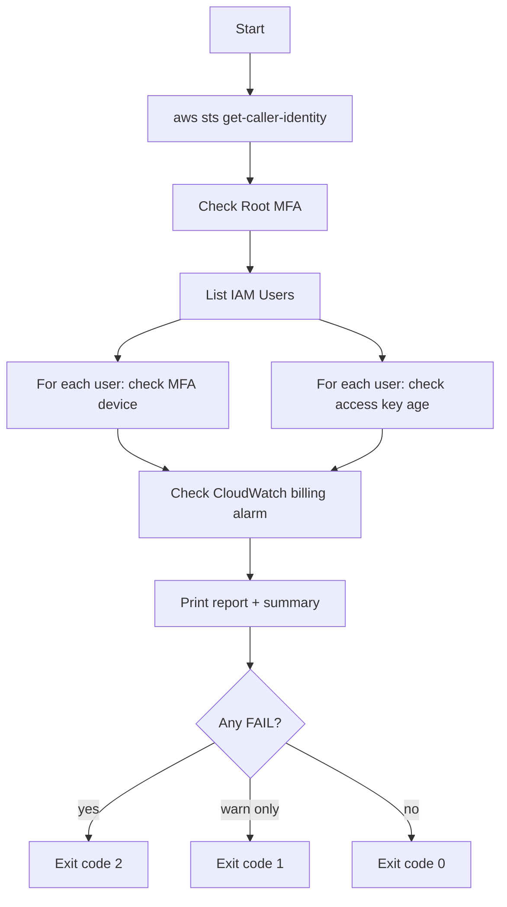

# AWS Security & Cost Hygiene Check

A read-only Bash script that audits an AWS account against a handful of
foundational security and cost-control best practices — the same ones
tested in the **AWS Certified Cloud Practitioner (CLF-C02)** exam.

## What it checks

| Check | Why it matters |
|---|---|
| Root account MFA | The root user has unrestricted access; losing those credentials without MFA is a critical risk. |
| IAM user MFA | Defense in depth — a leaked password alone shouldn't be enough to access the account. |
| Access key age | Long-lived static credentials increase blast radius if leaked. AWS recommends periodic rotation. |
| CloudWatch billing alarm | Cloud costs can spike silently (misconfigured resources, runaway usage). An alarm is the cheapest insurance against bill shock. |

## Requirements

- `aws-cli` v2, authenticated (`aws sts get-caller-identity` must succeed)
- `jq`
- An IAM identity with at least: `iam:GetAccountSummary`, `iam:ListUsers`,
  `iam:ListMFADevices`, `iam:ListAccessKeys`, `cloudwatch:DescribeAlarms`
  (all read-only — this script makes no changes to your account)

## Usage

```bash
chmod +x setup-aws-security.sh
./setup-aws-security.sh                       # human-readable report
./setup-aws-security.sh --max-key-age-days 60 # stricter rotation policy
./setup-aws-security.sh --json                # machine-readable output (for CI)
```

Exit codes: `0` = all checks passed, `1` = warnings only, `2` = at least
one failed check. This makes it easy to fail a CI pipeline on real problems.

## How it works




## Automation status: implemented ✅

This repo runs `setup-aws-security.sh` daily via GitHub Actions
(`.github/workflows/security-check.yml`), authenticating to AWS with
**OpenID Connect (OIDC)** — no static AWS Access Key is stored anywhere
in GitHub. The workflow assumes an IAM role scoped to this exact repo
and branch, with only the five read-only permissions the script needs.

### A lesson learned: GitHub's "immutable" OIDC subject format

As of July 2026, GitHub changed the format of the `sub` claim issued in
its OIDC tokens for newly created repositories. The classic format
(`repo:OWNER/REPO:ref:refs/heads/BRANCH`) was replaced with an
ID-based format that survives renames:

repo:OWNER@<owner-id>/REPO@<repo-id>:ref:refs/heads/BRANCH

This exists so that if a GitHub username or repository name is later
freed up and claimed by someone else, that new owner can't forge a
`sub` claim that an old, still-trusted IAM role would accept. Most
existing tutorials (and most LLM training data) still document the old
format — this project's IAM trust policy pins the *new*, ID-based
`sub` value with `StringEquals`, verified directly against the actual
claim captured in AWS CloudTrail during setup.

### Using this in your own AWS account

This workflow does not hardcode any AWS account ID. To adapt it:

1. Create your own OIDC identity provider for
   `token.actions.githubusercontent.com` in IAM (skip if one already
   exists in your account — only one is needed per AWS account).
2. Create an IAM role trusted by that provider, with a trust policy
   scoped to your fork's `owner/repo` and branch. Check GitHub's
   current `sub` claim format for your repo (see lesson above) before
   writing the condition — don't assume the classic format still
   applies.
3. Attach a read-only policy granting: `iam:GetAccountSummary`,
   `iam:ListUsers`, `iam:ListMFADevices`, `iam:ListAccessKeys`,
   `cloudwatch:DescribeAlarms`.
4. In your fork's repo settings, go to **Settings → Secrets and
   variables → Actions → Variables**, and add a repository variable
   named `AWS_ROLE_ARN` with your role's ARN. Nothing needs to change
   in the workflow file itself — it already reads
   `${{ vars.AWS_ROLE_ARN }}`.


## Notes

- This script is intentionally **read-only** — it reports issues, it does
  not fix them automatically. Auto-remediation is a reasonable v2 feature
  but should be opt-in and carefully scoped.
- Billing alarms only exist in `us-east-1` regardless of your default
  region — the script hardcodes that region for that specific check.
